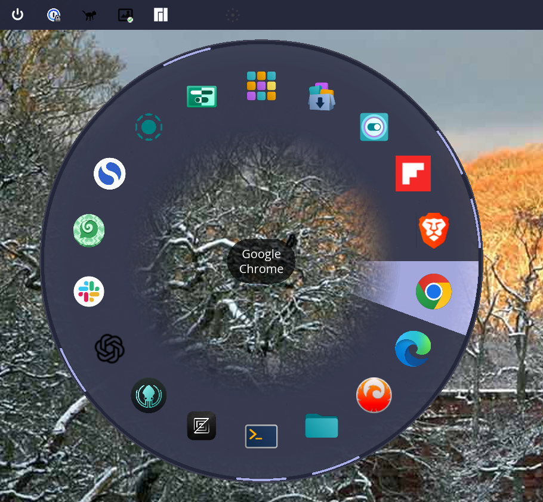
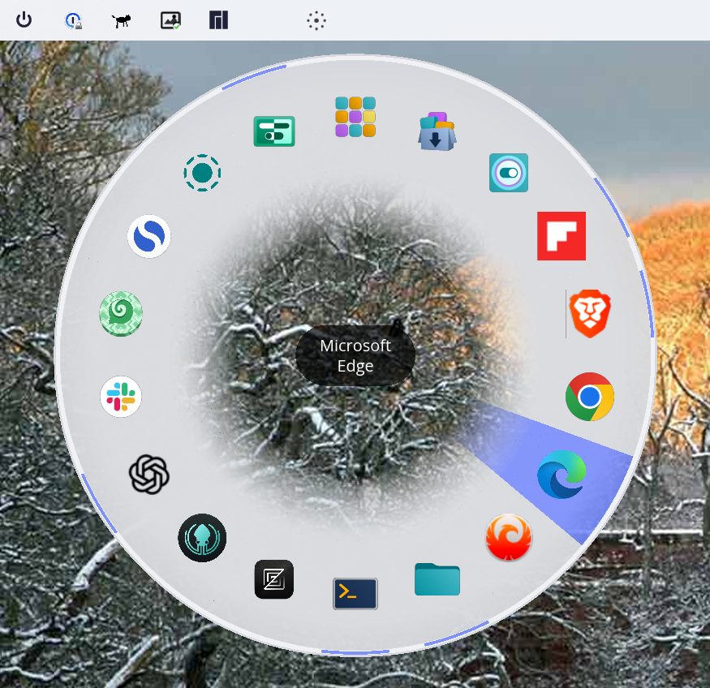

# COSMIC Pie Menu

A radial/pie menu app launcher for the [COSMIC desktop environment](https://system76.com/cosmic) that mirrors your dock favorites and applets.


| Dark Theme | Light Theme |
|:----------:|:-----------:|
|  |  |

## About This Project

This project was developed collaboratively between **Dr. Roy C. Davies** and **Claude** (Anthropic's AI assistant) using [Claude Code](https://claude.ai/claude-code). The entire application—from initial concept to working release—was built through natural language conversation.

This is the third project in a series exploring human-AI collaboration for COSMIC desktop development:
1. [cosmic-bing-wallpaper](https://github.com/reality2-roycdavies/cosmic-bing-wallpaper) - Daily Bing wallpaper integration
2. [cosmic-runkat](https://github.com/reality2-roycdavies/cosmic-runkat) - Animated CPU monitor tray icon
3. **cosmic-pie-menu** (this project) - Radial app launcher

All three projects serve as case studies in AI-assisted software development, with complete documentation of the process.

## Features

- **Radial Layout**: Apps arranged in a circular pie menu for quick access
- **COSMIC Theme Integration**: Colors automatically match your COSMIC desktop theme (light/dark)
- **Smooth Visual Effects**: Segments fade from transparent at center to solid at edges
- **Accent Color Highlighting**: Hover uses your theme's accent color
- **Running App Indicators**: Outer ring shows which apps are running using theme accent color
- **Touchpad Gesture**: Configurable 3 or 4 finger tap to open menu at cursor position
- **Dock Integration**: Automatically reads favorites from COSMIC dock configuration
- **Dock Applets**: Includes App Library, Launcher, and Workspaces buttons from your dock
- **Right-Click to Switch**: Right-click a running app to switch to its window instead of launching a new instance
- **Non-Favorite Running Apps**: Displays running apps that aren't dock favorites
- **Dynamic Sizing**: Menu radius scales based on number of apps
- **Dynamic Icon Positioning**: Icons positioned optimally based on pie size
- **Icon Support**: Displays app icons (SVG and PNG) with fallback to initials
- **Center Display**: Shows app name with readable background pill when hovering
- **Transparent Center**: See through to your desktop in the center of the menu
- **Keyboard Support**: Press Escape to close, or click the center
- **COSMIC Panel Applet**: Native panel integration with popup menu
- **Scaled Display Support**: Works correctly on HiDPI/scaled displays
- **Suspend/Resume Safe**: Uses full-screen layer surface for reliable display

## Installation

### Prerequisites

Before building, install the required system dependencies:

```bash
# Debian/Ubuntu
sudo apt install libwayland-dev libxkbcommon-dev libssl-dev pkg-config

# Fedora
sudo dnf install wayland-devel libxkbcommon-devel openssl-devel

# Arch
sudo pacman -S wayland libxkbcommon openssl
```

Note: Gesture detection uses the `evdev` crate which reads directly from `/dev/input/` - no libinput required.

You'll also need the Rust toolchain (1.75 or later). Install via [rustup](https://rustup.rs/):

```bash
curl --proto '=https' --tlsv1.2 -sSf https://sh.rustup.rs | sh
```

### Gesture Detection Setup

To enable touchpad gesture detection (3 or 4 finger tap, configurable via Settings), your user must be in the `input` group:

```bash
sudo gpasswd -a $USER input
```

Apply the change immediately (without logout):

```bash
newgrp input
```

Or **log out and back in** for the change to take effect permanently.

> **Note**: This grants read access to `/dev/input/` devices. If this is a privacy or security concern for your use case, be aware of this implication.

Without input group membership, the panel applet will still work but gesture detection will be disabled.

### From Release (Recommended)

Download the latest pre-built binary from [GitHub Releases](https://github.com/reality2-roycdavies/cosmic-pie-menu/releases):

```bash
# Download latest release
wget https://github.com/reality2-roycdavies/cosmic-pie-menu/releases/latest/download/cosmic-pie-menu

# Make executable and install
chmod +x cosmic-pie-menu
sudo mv cosmic-pie-menu /usr/local/bin/

# Or install to user directory
mkdir -p ~/.local/bin
mv cosmic-pie-menu ~/.local/bin/
```

### From Source

```bash
# Clone the repository
git clone https://github.com/reality2-roycdavies/cosmic-pie-menu.git
cd cosmic-pie-menu

# Build in release mode
cargo build --release

# Install binary, desktop entry, and icon
sudo cp target/release/cosmic-pie-menu /usr/local/bin/
sudo cp resources/io.github.reality2_roycdavies.cosmic-pie-menu.desktop /usr/share/applications/
sudo cp resources/io.github.reality2_roycdavies.cosmic-pie-menu-symbolic.svg /usr/share/icons/hicolor/symbolic/apps/
```

Then add the applet to your COSMIC panel via **Settings → Desktop → Panel → Applets**.

### Dependencies

- Rust 1.75 or later
- COSMIC desktop environment (or libcosmic)
- Access to `/dev/input/` (for gesture detection - requires `input` group membership)

## Usage

### Panel Applet

After installation, add the applet to your COSMIC panel:

1. Open **COSMIC Settings → Desktop → Panel**
2. Click **Applets** and add **COSMIC Pie Menu**

The panel applet provides:
- **Panel icon**: Click to open a popup with "Show Pie Menu" and "Settings" buttons
- **Touchpad gesture**: Tap with configured number of fingers on your touchpad

### Gesture Workflow

**Tap to Open Pie Menu:**
1. **Multi-finger tap** on touchpad (3 or 4 fingers, configurable)
2. **Move mouse** to where you want the menu
3. **Lift fingers** - menu appears at cursor position
4. **Press Escape** once the menu appears to close it without selecting an app

**Swipe for Quick Actions:**
1. **Multi-finger swipe** in a configured direction
2. Action triggers immediately when movement threshold is exceeded (no need to lift fingers)
3. Available directions depend on your workspace layout (see Settings)

The gesture detection distinguishes taps from swipes based on movement. Swipes reserved by the system for workspace switching are ignored.

### Keyboard Shortcut

You can also add a keyboard shortcut to show the pie menu:

1. Open **COSMIC Settings**
2. Navigate to **Keyboard** → **Keyboard Shortcuts**
3. Add a custom shortcut:
   - **Command**: `cosmic-pie-menu --track`
   - **Shortcut**: Your preferred key combo (e.g., `Super+Space` or `Ctrl+Alt+P`)

The `--track` option briefly displays an invisible overlay to capture the cursor position, then shows the menu there.

## How It Works

1. Reads dock applets from `~/.config/cosmic/com.system76.CosmicPanel.Dock/v1/plugins_center`
2. Reads dock favorites from `~/.config/cosmic/com.system76.CosmicAppList/v1/favorites`
3. Detects running applications via Wayland's `ext_foreign_toplevel_list_v1` protocol
4. Parses `.desktop` files to get app names, icons, and launch commands
5. Displays apps in a radial layout using libcosmic's layer-shell support
6. Left-click an app segment to launch it, right-click a running app to switch to it
7. Click the center or press Escape to close

## Configuration

### Settings Window

Click the panel applet and select **Settings** to open the configuration window. Settings are saved to `~/.config/cosmic-pie-menu/config.json` and take effect immediately (hot-reload).

| Setting | Description | Default |
|---------|-------------|---------|
| **Finger Count** | Number of fingers for tap gesture (3 or 4) | 4 |
| **Tap Duration** | Maximum time for tap gesture in ms (100-500) | 200ms |
| **Movement Threshold** | Maximum finger movement during tap in touchpad units (200-1000) | 500 |
| **Swipe Up** | Action to trigger on swipe up | Workspaces |
| **Swipe Down** | Action to trigger on swipe down | App Library |
| **Swipe Left/Right** | Action to trigger on swipe left/right | None |
| **Swipe Threshold** | Minimum movement to trigger swipe in touchpad units (100-600) | 300 |

**Gesture Settings:**
- Lower tap duration values require quicker taps
- Higher movement threshold allows more finger movement during the tap (useful if your taps aren't perfectly still)

**Swipe Actions:**
- Swipes can be configured to open App Library, Launcher, Workspaces, Pie Menu, or pass through to the system
- Available swipe directions depend on your COSMIC workspace layout:
  - **Horizontal workspaces**: Up/Down swipes are configurable (Left/Right used by system for workspace switching)
  - **Vertical workspaces**: Left/Right swipes are configurable (Up/Down used by system for workspace switching)
- Swipes are detected early when movement threshold is exceeded (no need to lift fingers first)

### Dock Apps

The pie menu displays apps from your COSMIC dock configuration:

1. Open COSMIC Settings → Dock
2. Add or remove apps from your dock favorites
3. The pie menu will reflect these changes on next launch

## Building

See [Prerequisites](#prerequisites) for required system dependencies.

### Build Commands

```bash
# Debug build
cargo build

# Release build (recommended)
cargo build --release

# Run the applet (standalone, for testing)
cargo run
```

## Project Structure

```
cosmic-pie-menu/
├── src/
│   ├── main.rs       # Entry point and subprocess routing
│   ├── applet.rs     # COSMIC panel applet with popup menu
│   ├── apps.rs       # Desktop file parsing and icon lookup
│   ├── config.rs     # Config loading (dock favorites + gesture settings)
│   ├── gesture.rs    # Touchpad gesture detection (evdev)
│   ├── pie_menu.rs   # Radial menu UI (canvas-based with theme integration)
│   ├── settings.rs   # Settings window UI
│   └── windows.rs    # Running app detection via Wayland protocol
├── docs/
│   ├── README.md             # Documentation overview
│   ├── DEVELOPMENT.md        # Technical learnings
│   ├── THEMATIC_ANALYSIS.md  # AI collaboration patterns
│   └── transcripts/          # Full development conversation
├── screenshots/              # Application screenshots
├── resources/
│   ├── io.github.reality2_roycdavies.cosmic-pie-menu.desktop
│   └── io.github.reality2_roycdavies.cosmic-pie-menu-symbolic.svg
├── Cargo.toml
├── LICENSE
└── README.md
```

## Cursor Position on Wayland

Traditional pie menus (like [Kando](https://github.com/kando-menu/kando)) open at the cursor position when triggered. This is challenging on Wayland due to its security model.

### The Wayland Security Model

Unlike X11, Wayland was designed with security in mind. One key restriction: **applications cannot query the global cursor position**. An app only knows where the cursor is when it's over that app's own window.

This is intentional—it prevents malicious apps from tracking your mouse movements across the desktop.

### How This Project Solves It

**Gesture-based activation** (recommended): The four-finger tap gesture workflow naturally solves this:
1. Tap triggers gesture detection (via evdev, not Wayland)
2. A transparent full-screen overlay appears
3. Move mouse to desired position (overlay captures this)
4. Release to show menu at captured position

**Keyboard shortcut with `--track`**: Uses a brief full-screen transparent overlay to capture cursor position before showing the menu.

**Keyboard shortcut with `--pie`**: Opens menu centered on screen (predictable, no cursor tracking needed).

## Known Issues

- **First Launch on Scaled Displays**: May briefly show incorrect size before correcting (within 500ms).
- **Web App Detection**: Some PWAs/web apps may not be detected if their app_id doesn't match a desktop file pattern.
- **Gesture Detection Requires input Group**: If gestures aren't working, ensure your user is in the `input` group and you've logged out/in.

## Contributing

Contributions are welcome! Please feel free to submit issues and pull requests.

1. Fork the repository
2. Create your feature branch (`git checkout -b feature/amazing-feature`)
3. Commit your changes (`git commit -m 'Add amazing feature'`)
4. Push to the branch (`git push origin feature/amazing-feature`)
5. Open a Pull Request

## Development Documentation

The [docs/](docs/) directory contains detailed documentation about the development process:

| Document | Description |
|----------|-------------|
| [DEVELOPMENT.md](docs/DEVELOPMENT.md) | Technical learnings and solutions discovered |
| [THEMATIC_ANALYSIS.md](docs/THEMATIC_ANALYSIS.md) | Analysis of patterns in AI-assisted development |
| [transcripts/](docs/transcripts/) | Complete conversation logs from the development session |

### Key Technical Insights

From developing this project, several notable patterns emerged:

- **Canvas over Widgets**: Standard row/column layouts couldn't achieve true circular positioning. Canvas-based rendering with trigonometry provided full control over radial geometry.

- **Wayland Security Model**: Unlike X11, Wayland doesn't expose global cursor position to applications. Solved via transparent overlay that captures cursor on mouse movement.

- **Native Panel Applet**: Using libcosmic's `applet` feature provides automatic panel integration, popup menus, and theme support without the complexity of D-Bus-based system tray protocols.

- **Gesture Detection via evdev**: Linux evdev subsystem provides raw touchpad events (BTN_TOOL_TRIPLETAP, BTN_TOOL_QUADTAP, ABS_MT_POSITION) independent of compositor handling. Distinguishing taps from swipes requires tracking both duration and finger movement.

- **Running App Detection**: COSMIC supports `ext_foreign_toplevel_list_v1` Wayland protocol for detecting running applications. This required subprocess isolation to avoid Wayland connection conflicts with libcosmic.

- **Window Activation**: Right-click to switch uses COSMIC's `zcosmic_toplevel_manager_v1` protocol with `zcosmic_toplevel_info_v1` for window enumeration. This is a COSMIC-specific extension that allows activating existing windows by app_id.

- **Full-Screen Layer Surface**: Using anchored full-screen surfaces (`Anchor::TOP | BOTTOM | LEFT | RIGHT`) is more reliable than fixed-size centered windows, especially after suspend/resume cycles.

- **Scaled Display Challenges**: HiDPI displays (e.g., 150% scaling) cause initial layout miscalculations. Solution: skip drawing until bounds correct + timer-based layout refresh.

- **Layer-Shell for Overlays**: COSMIC/Wayland's layer-shell protocol enables floating overlay windows without traditional window decorations.

- **Arc Drawing Quirks**: Standard canvas `arc()` functions behaved unexpectedly. Manual line-segment approximation gave predictable results.

- **Theme Integration**: COSMIC themes accessed via `cosmic::theme::system_preference()` provide consistent colors. Using `background.component` colors matches dock/panel appearance. Gradients simulated with concentric ring strokes (no native gradient support in iced canvas).

- **Icon Discovery Complexity**: Finding the right icon involves multiple paths (system themes, Flatpak, alternate names) and format handling (SVG vs PNG). App IDs like "Slack" need fuzzy matching to find "com.slack.Slack.desktop".

### Development Approach

The iterative development process demonstrated effective human-AI collaboration:

1. **Visual feedback loops** - UI evolved through "looks wrong" → code change → "better" cycles
2. **Platform discovery** - AI suggests approaches, real-world testing reveals actual behavior
3. **Scope flexibility** - Features like cursor-position menus were descoped when complexity exceeded value
4. **Accumulated learning** - Solutions from previous projects (ksni tray, layer-shell, config paths) were directly reusable

## License

This project is licensed under the GPL-3.0 License - see the [LICENSE](LICENSE) file for details.

## Acknowledgments

- [System76](https://system76.com/) for the COSMIC desktop environment
- [libcosmic](https://github.com/pop-os/libcosmic) for the UI framework
- [iced](https://github.com/iced-rs/iced) for the underlying GUI library
- [evdev](https://github.com/emberian/evdev) for Linux input device access
- [Kando](https://github.com/kando-menu/kando) for pie menu inspiration
- [Claude](https://claude.ai/) (Anthropic) for AI-assisted development collaboration
