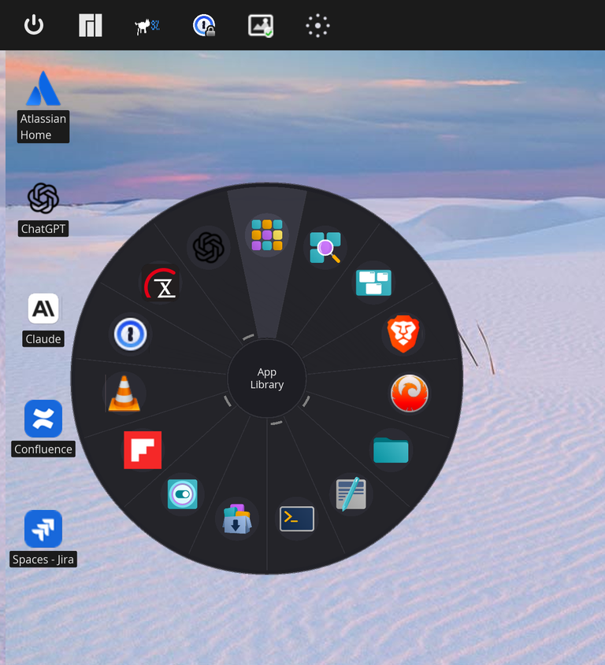

# COSMIC Pie Menu

A radial/pie menu app launcher for the [COSMIC desktop environment](https://system76.com/cosmic) that mirrors your dock favorites and applets.




## About This Project

This project was developed collaboratively between **Dr. Roy C. Davies** and **Claude** (Anthropic's AI assistant) using [Claude Code](https://claude.ai/claude-code). The entire application—from initial concept to working release—was built through natural language conversation.

This is the third project in a series exploring human-AI collaboration for COSMIC desktop development:
1. [cosmic-bing-wallpaper](https://github.com/reality2-roycdavies/cosmic-bing-wallpaper) - Daily Bing wallpaper integration
2. [cosmic-runkat](https://github.com/reality2-roycdavies/cosmic-runkat) - Animated CPU monitor tray icon
3. **cosmic-pie-menu** (this project) - Radial app launcher

All three projects serve as case studies in AI-assisted software development, with complete documentation of the process.

## Features

- **Radial Layout**: Apps arranged in a circular pie menu for quick access
- **Touchpad Gesture**: Four-finger tap to open menu at cursor position
- **Dock Integration**: Automatically reads favorites from COSMIC dock configuration
- **Dock Applets**: Includes App Library, Launcher, and Workspaces buttons from your dock
- **Running App Detection**: Shows which apps are currently running with arc indicators
- **Non-Favorite Running Apps**: Displays running apps that aren't dock favorites
- **Dynamic Sizing**: Menu radius scales based on number of apps
- **Dynamic Icon Positioning**: Icons positioned optimally based on pie size
- **Icon Support**: Displays app icons (SVG and PNG) with fallback to initials
- **Hover Highlighting**: Subtle segment highlighting as you move the mouse
- **Center Display**: Shows app name in the center when hovering
- **Transparent Background**: Only the circular menu is visible
- **Keyboard Support**: Press Escape to close, or click the center
- **System Tray**: Theme-aware tray icon for click-to-open access
- **Theme Support**: Tray icon adapts to light/dark mode changes
- **Autostart**: Automatically creates autostart entry on first run
- **Scaled Display Support**: Works correctly on HiDPI/scaled displays
- **Suspend/Resume Safe**: Uses full-screen layer surface for reliable display

## Installation

### Prerequisites

Before building, install the required system dependencies:

```bash
# Debian/Ubuntu
sudo apt install libwayland-dev libxkbcommon-dev libssl-dev pkg-config

# Fedora
sudo dnf install wayland-devel libxkbcommon-devel openssl-devel

# Arch
sudo pacman -S wayland libxkbcommon openssl
```

Note: Gesture detection uses the `evdev` crate which reads directly from `/dev/input/` - no libinput required.

You'll also need the Rust toolchain (1.75 or later). Install via [rustup](https://rustup.rs/):

```bash
curl --proto '=https' --tlsv1.2 -sSf https://sh.rustup.rs | sh
```

### Gesture Detection Setup

To enable four-finger tap gesture detection, your user must be in the `input` group:

```bash
sudo gpasswd -a $USER input
```

Apply the change immediately (without logout):

```bash
newgrp input
```

Or **log out and back in** for the change to take effect permanently.

> **Note**: This grants read access to `/dev/input/` devices. If this is a privacy or security concern for your use case, be aware of this implication.

Without input group membership, the tray daemon will still work but gesture detection will be disabled.

### From Source

```bash
# Clone the repository
git clone https://github.com/reality2-roycdavies/cosmic-pie-menu.git
cd cosmic-pie-menu

# Build in release mode
cargo build --release

# Install to user local bin (recommended)
cp target/release/cosmic-pie-menu ~/.local/bin/

# Or install system-wide
sudo cp target/release/cosmic-pie-menu /usr/local/bin/
```

### Dependencies

- Rust 1.75 or later
- COSMIC desktop environment (or libcosmic)
- D-Bus (for system tray)
- Access to `/dev/input/` (for gesture detection - requires `input` group membership)

## Usage

### Command Line Options

| Option | Description |
|--------|-------------|
| (none) | Start tray daemon with system tray icon and gesture detection |
| `--pie` | Show pie menu centered on screen |
| `--track` | Show invisible overlay, capture cursor on mouse move, then show pie menu there |
| `--pie-at X Y` | Show pie menu at specific screen coordinates |

### With System Tray (Recommended)

Run the daemon with tray icon:

```bash
cosmic-pie-menu
```

This starts the background daemon which provides:
- **System tray icon**: Click to show the pie menu
- **Four-finger tap gesture**: Tap with four fingers on your touchpad, then move mouse to position and release

### Gesture Workflow

1. **Four-finger tap** on touchpad - tray icon turns cyan
2. **Move mouse** to where you want the menu
3. **Lift fingers** or **single tap** - menu appears at cursor position
4. **Press Escape** to cancel without showing menu

The gesture detection distinguishes taps from swipes - a four-finger swipe to change workspaces won't trigger the menu.

### Direct Launch (Centered)

Show the pie menu centered on screen:

```bash
cosmic-pie-menu --pie
```

### Direct Launch (Cursor Tracking)

Attempt to show the pie menu at the cursor position:

```bash
cosmic-pie-menu --track
```

This briefly displays an invisible overlay to capture the cursor position, then shows the menu there. If cursor capture fails within 500ms, it falls back to centered. See [Why No Mouse Activation?](#why-no-mouse-activation) for details on Wayland limitations.

### Keyboard Shortcut (Recommended)

1. Open **COSMIC Settings**
2. Navigate to **Keyboard** → **Keyboard Shortcuts**
3. Add a custom shortcut:
   - **Command**: `cosmic-pie-menu --track` (or `--pie` for always-centered)
   - **Shortcut**: Your preferred key combo (e.g., `Super+Space` or `Ctrl+Alt+P`)

### Autostart

The tray daemon automatically creates an autostart entry on first run at `~/.config/autostart/cosmic-pie-menu.desktop`. After running `cosmic-pie-menu` once, it will start automatically on login.

To manually set up autostart:

```bash
mkdir -p ~/.config/autostart
cat > ~/.config/autostart/cosmic-pie-menu.desktop << EOF
[Desktop Entry]
Name=COSMIC Pie Menu
Exec=cosmic-pie-menu
Type=Application
X-GNOME-Autostart-enabled=true
EOF
```

## How It Works

1. Reads dock applets from `~/.config/cosmic/com.system76.CosmicPanel.Dock/v1/plugins_center`
2. Reads dock favorites from `~/.config/cosmic/com.system76.CosmicAppList/v1/favorites`
3. Detects running applications via Wayland's `ext_foreign_toplevel_list_v1` protocol
4. Parses `.desktop` files to get app names, icons, and launch commands
5. Displays apps in a radial layout using libcosmic's layer-shell support
6. Click an app segment to launch it, or click the center/press Escape to close

## Configuration

Currently, the pie menu reads directly from the COSMIC dock favorites. To change which apps appear:

1. Open COSMIC Settings → Dock
2. Add or remove apps from your dock favorites
3. The pie menu will reflect these changes on next launch

Future versions may include a dedicated settings interface.

## Building

See [Prerequisites](#prerequisites) for required system dependencies.

### Build Commands

```bash
# Debug build
cargo build

# Release build (recommended)
cargo build --release

# Run directly
cargo run -- --pie
```

## Project Structure

```
cosmic-pie-menu/
├── src/
│   ├── main.rs       # Entry point and tray event loop
│   ├── apps.rs       # Desktop file parsing and icon lookup
│   ├── config.rs     # COSMIC dock config reader
│   ├── gesture.rs    # Touchpad gesture detection (evdev)
│   ├── pie_menu.rs   # Radial menu UI (canvas-based)
│   ├── tray.rs       # System tray icon with gesture feedback
│   └── windows.rs    # Running app detection via Wayland protocol
├── docs/
│   ├── README.md             # Documentation overview
│   ├── DEVELOPMENT.md        # Technical learnings
│   ├── THEMATIC_ANALYSIS.md  # AI collaboration patterns
│   └── transcripts/          # Full development conversation
├── Cargo.toml
├── cosmic-pie-menu.desktop
├── LICENSE
└── README.md
```

## Cursor Position on Wayland

Traditional pie menus (like [Kando](https://github.com/kando-menu/kando)) open at the cursor position when triggered. This is challenging on Wayland due to its security model.

### The Wayland Security Model

Unlike X11, Wayland was designed with security in mind. One key restriction: **applications cannot query the global cursor position**. An app only knows where the cursor is when it's over that app's own window.

This is intentional—it prevents malicious apps from tracking your mouse movements across the desktop.

### How This Project Solves It

**Gesture-based activation** (recommended): The four-finger tap gesture workflow naturally solves this:
1. Tap triggers gesture detection (via evdev, not Wayland)
2. A transparent full-screen overlay appears
3. Move mouse to desired position (overlay captures this)
4. Release to show menu at captured position

**Keyboard shortcut with `--track`**: Uses a brief full-screen transparent overlay to capture cursor position before showing the menu.

**Keyboard shortcut with `--pie`**: Opens menu centered on screen (predictable, no cursor tracking needed).

## Known Issues

- **First Launch on Scaled Displays**: May briefly show incorrect size before correcting (within 500ms).
- **Web App Detection**: Some PWAs/web apps may not be detected if their app_id doesn't match a desktop file pattern.
- **Gesture Detection Requires input Group**: If gestures aren't working, ensure your user is in the `input` group and you've logged out/in.

## Contributing

Contributions are welcome! Please feel free to submit issues and pull requests.

1. Fork the repository
2. Create your feature branch (`git checkout -b feature/amazing-feature`)
3. Commit your changes (`git commit -m 'Add amazing feature'`)
4. Push to the branch (`git push origin feature/amazing-feature`)
5. Open a Pull Request

## Development Documentation

The [docs/](docs/) directory contains detailed documentation about the development process:

| Document | Description |
|----------|-------------|
| [DEVELOPMENT.md](docs/DEVELOPMENT.md) | Technical learnings and solutions discovered |
| [THEMATIC_ANALYSIS.md](docs/THEMATIC_ANALYSIS.md) | Analysis of patterns in AI-assisted development |
| [transcripts/](docs/transcripts/) | Complete conversation logs from the development session |

### Key Technical Insights

From developing this project, several notable patterns emerged:

- **Canvas over Widgets**: Standard row/column layouts couldn't achieve true circular positioning. Canvas-based rendering with trigonometry provided full control over radial geometry.

- **Wayland Security Model**: Unlike X11, Wayland doesn't expose global cursor position to applications. Solved via transparent overlay that captures cursor on mouse movement.

- **Gesture Detection via evdev**: Linux evdev subsystem provides raw touchpad events (BTN_TOOL_QUADTAP, ABS_MT_POSITION) independent of compositor handling. Distinguishing taps from swipes requires tracking both duration and finger movement.

- **Running App Detection**: COSMIC supports `ext_foreign_toplevel_list_v1` Wayland protocol for detecting running applications. This required subprocess isolation to avoid Wayland connection conflicts with libcosmic.

- **Full-Screen Layer Surface**: Using anchored full-screen surfaces (`Anchor::TOP | BOTTOM | LEFT | RIGHT`) is more reliable than fixed-size centered windows, especially after suspend/resume cycles.

- **Scaled Display Challenges**: HiDPI displays (e.g., 150% scaling) cause initial layout miscalculations. Solution: skip drawing until bounds correct + timer-based layout refresh.

- **Layer-Shell for Overlays**: COSMIC/Wayland's layer-shell protocol enables floating overlay windows without traditional window decorations.

- **Arc Drawing Quirks**: Standard canvas `arc()` functions behaved unexpectedly. Manual line-segment approximation gave predictable results.

- **Icon Discovery Complexity**: Finding the right icon involves multiple paths (system themes, Flatpak, alternate names) and format handling (SVG vs PNG). App IDs like "Slack" need fuzzy matching to find "com.slack.Slack.desktop".

### Development Approach

The iterative development process demonstrated effective human-AI collaboration:

1. **Visual feedback loops** - UI evolved through "looks wrong" → code change → "better" cycles
2. **Platform discovery** - AI suggests approaches, real-world testing reveals actual behavior
3. **Scope flexibility** - Features like cursor-position menus were descoped when complexity exceeded value
4. **Accumulated learning** - Solutions from previous projects (ksni tray, layer-shell, config paths) were directly reusable

## License

This project is licensed under the GPL-3.0 License - see the [LICENSE](LICENSE) file for details.

## Acknowledgments

- [System76](https://system76.com/) for the COSMIC desktop environment
- [libcosmic](https://github.com/pop-os/libcosmic) for the UI framework
- [iced](https://github.com/iced-rs/iced) for the underlying GUI library
- [evdev](https://github.com/emberian/evdev) for Linux input device access
- [Kando](https://github.com/kando-menu/kando) for pie menu inspiration
- [Claude](https://claude.ai/) (Anthropic) for AI-assisted development collaboration
